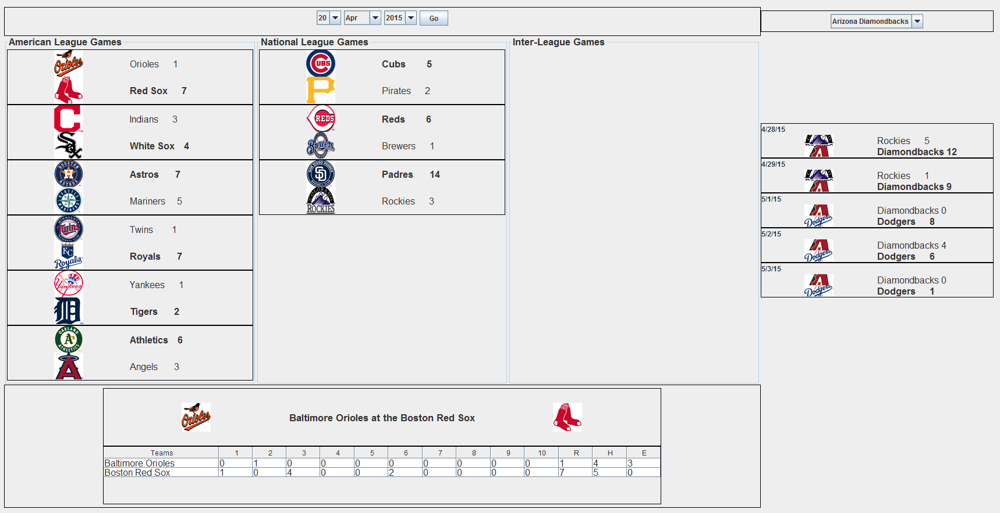

# MLBscores
This program is a collaboration of Ben Muirhead and Samuel Doud
View the repository at https://github.com/benmuirhead/MLBscores

###Overview
This program displays MLB scores from 2013 to 2015. 
To open the program, compile the enclosed java files (use the editor or terminal of your choice) and run.

To view the detailed score of any game, click on that game. To change the selected date, simply change the dropdown date menu and press Go. To see the most recent games of a single team, select that team from the dropdown on the right

If a single date is given, then the program will show the scores of all the games played on that day. The games are divided into their respective leagues, as well as inter-league games.

To view the detailed line score of a game, simply click on that game.

###Classes
The classes to the program are organized as fallows:

* Run: Runs the program, generating the GUI
* GUI: creates the Graphical User Interface to display the graphics components of the games
* Game: A class based on the URL accessed from the MLB API. It finds the information for a certain game as delegated by the GameDay or GameRange classes. Creates the Swing components to display the games.
* GameDay: Organizes the games of a given date and sends Swing components of score to the GUI in an organized fashion
* GameRange: Same function as GameDay except the given information is a single team over a range of dates
* Team: A class which stores the information for curent MLB teams. This information includes abbreviation, name, city, and logo. To quickly assign information, a binary search is implemented.
* Utility: Contains several utility methods, including a JSONValueReader and methods for converting Calendars to Dates and back